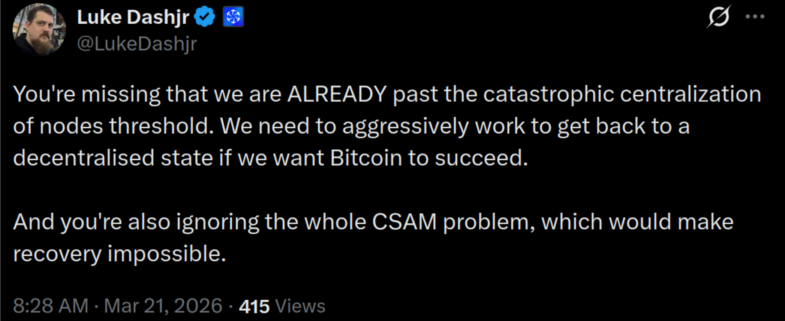
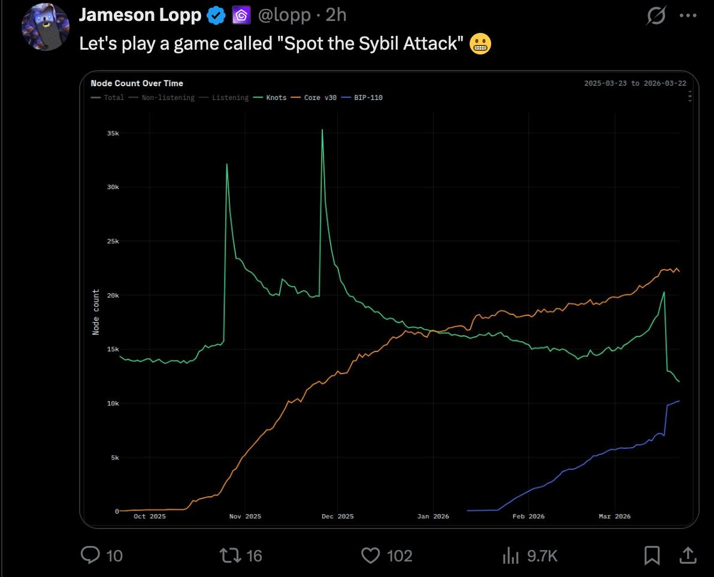

---
---

## Purpose

For more than two years, I have been building and operating a large-scale Bitcoin node fleet to test a network-layer weakness in Bitcoin's visible peer-to-peer topology.

The question was simple: **how hard is it for one operator, using ordinary infrastructure and a non-exotic budget, to occupy a meaningful share of the public node surface and influence which peers other nodes discover and connect to?**

My conclusion is that it is far easier than many people assume.

This page is a public disclosure of that work.

It is **not** a confession of a covert attack, and it is **not** a last-minute stunt created for the current `BIP110` fight. This infrastructure has existed for years. What changed recently is that I rolled much of the fleet from Bitcoin Core to Knots in order to signal my support for `BIP110`. Public node-count dashboards track reachable nodes by user agent and version, so a version change across a large fleet becomes visible very quickly.

The actual problem is deeper than any one software branch or political fight. Bitcoin nodes do not choose peers based on operator identity. They choose peers from addresses they have learned about through bootstrapping, gossip, and prior history. Bitcoin Core tries to diversify those peers across `/16` ranges by default and across ASNs if `asmap` is enabled, but those are still routing heuristics, not identity. If one actor can cheaply occupy enough address space across enough routing buckets, that actor can look decentralized to the software while remaining centrally controlled in reality.

That is the issue this project was built to demonstrate.

## Why this matters

Bitcoin's public node network is part of how the system presents itself to new peers, propagates addresses, relays transactions and blocks, and provides observers with a picture of the network. A new node typically boots from DNS seeds or previously learned peers, completes the normal `version` / `verack` handshake, uses `getaddr` / `addr` to discover more peers, and then exchanges `inv`, `getdata`, `tx`, and `block` messages across a relatively small number of outbound connections. That means the shape of the visible node surface matters.

The problem is not that one actor can magically rewrite Bitcoin consensus just by running many nodes. The problem is that one actor can cheaply become a large part of the public surface that other nodes see, learn from, and connect to. That affects topology, measurements, peer selection, public dashboards, and the assumptions people make when they look at "node count" as evidence of decentralization or support.

In other words: if the software is trying to diversify across network coordinates rather than real operators, then a determined infrastructure operator can satisfy the heuristic while still concentrating control.

That is why this is a vulnerability disclosure and not just an infrastructure diary.

## Why you are hearing about this now

Two recent posts on X made it clear to me that this work needed to be disclosed publicly.

One was Luke Dashjr arguing that the Bitcoin network is already catastrophically centralized. The other was Jameson Lopp pointing to what looked like a Sybil event in public node-count data.

From my perspective, both observations were directionally correct, but the public interpretation was missing an important fact: these were **not** thousands of brand-new nodes suddenly appearing from nowhere. The fleet already existed. What changed visibly was the software mix across the fleet.

*Luke Dashjr calling out what he sees as catastrophic node centralization.*

*Jameson Lopp reacting to node-count data that changed sharply when I rolled software changes across an already-existing fleet.*

That distinction matters.

If a large operator quietly runs thousands of publicly reachable nodes under one user agent, many people will simply treat that as background network reality. If that same operator flips a large portion of the fleet from Core to Knots, or turns on visible signaling, charts move and people suddenly notice. The move did not create the underlying concentration risk. It only exposed it.

## What this project demonstrates

This work demonstrates four things.

1. A single actor can stand up and operate a very large publicly reachable Bitcoin node fleet at much lower cost than many people assume.
2. A single actor can spread that fleet across multiple `/24`s, multiple `/16` boundaries, and multiple ASNs, making it appear far more independent than it really is.
3. Existing peer-diversity heuristics help, but they do not solve the operator-identity problem.
4. Public node-count narratives can be badly misleading when they are treated as proof of decentralization, neutrality, or grassroots economic consensus.

I did not build this to feed false chain history to users, to partition the network, or to fake some kind of economic majority. I built it to answer a hard question with infrastructure instead of rhetoric: **how much of Bitcoin's visible node surface can one operator cheaply occupy today?**

The answer is: enough to matter.

## Journey

The path from discovery to disclosure was not linear.

More than two years ago, I found myself with extra time and decided to contribute to something I had believed in for many years: Bitcoin. I did not come into this as a protocol developer, and I still do not claim to understand every layer of Bitcoin as deeply as the people who work in the code every day. What I do understand is production infrastructure: networks, systems, routing, failure domains, proxies, capacity, and operational behavior at scale.

That is where I focused.

After a few weeks of digging in, I found a weakness that, as far as I could tell, was not being framed clearly enough. The networking layers around Bitcoin nodes were making assumptions that worked reasonably well against casual concentration, but not against a motivated operator with real Internet resources.

Once I started proving it out, this stopped feeling like a normal bug report.

It became a security dilemma.

When a weakness exists in the way a network discovers and diversifies peers, and there is no clean way to make it disappear overnight, everyone has an incentive to either deny it, test it, exploit it, defend against it, or get there first. That is part of what makes it dangerous.

Over the last two years I kept expanding the work: raising the issue, being told to prove it harder, expanding the infrastructure, refining the design, asking for support, being denied, and continuing anyway.

That cycle eventually led here.

## Scale and cost

I started with a single `/24` of address space, all running as full Bitcoin nodes.

From there I expanded to four `/24`s, and then to twelve `/24`s spread across three different ASNs.

The cost side is one of the most important parts of the disclosure.

A common reaction is to assume that operating infrastructure at this scale must require a massive budget. In my experience, that assumption is wrong. The setup I built, which runs roughly `3,000` IPv4-reachable full Bitcoin nodes, can be operated for about `$2,000` per month, with roughly `$5,000` in one-time hardware cost using refurbished Dell servers.

That matters because it means the barrier to building a very large visible node fleet is much lower than many people think.

The important point is not any one vendor or any one colo. The important point is that commodity servers, colocation, transit, IP space, containers, and some careful proxying can be combined into a very large reachable footprint surprisingly cheaply.

## How it was built

The mechanics were not exotic. They were mostly standard infrastructure, applied in a way that Bitcoin's current peer-selection assumptions were not prepared for.

1. Establish ordinary network infrastructure: BGP sessions, route advertisements, downstream topology, and the rest of the routine engineering needed to support the footprint.
2. Stand up Proxmox on the servers with ZFS storage, ZFS deduplication, and the host ready to run LXC containers.
3. Deploy a Bitcoin node in an LXC container and allow a full sync to complete.
4. Stand up a forward proxy to seed the full public IP footprint onto the Bitcoin network, and policy-route TCP source port `8333` toward that proxy.
5. Create `12` to `36` linked clones of the synchronized Bitcoin node, using ZFS linked clones with deduplication enabled. In practice, a large ARC allocation in RAM is strongly recommended.
6. Configure those Bitcoin nodes to use the outbound forward proxy so that outbound activity can be distributed correctly across the available public IP space.
7. Stand up `4` to `8` inbound reverse proxies, again using `haproxy`, listening on public IP addresses and forwarding inbound connections back toward the linked clones.
8. Let it run. Once built correctly, the amount of traffic, peer discovery, and visibility it attracts makes the point on its own.

The design is important because this was not built with magical protocol changes or custom consensus logic. It was built with standard infrastructure techniques.

That is precisely why it matters.

## What this is not

This project is not an argument that Bitcoin is broken beyond repair.

It is not an argument that every large node operator is malicious.

It is not an argument that Bitcoin Core or Knots developers are stupid.

And it is not a claim that I achieved some permanent one-party control over the network.

It is a demonstration that the visible public node surface is easier to occupy, concentrate, and cosmetically distribute than many people want to admit.

That means node counts should be treated with much more caution.

It also means that discussions about decentralization should spend more time on operator concentration, routing concentration, and discovery mechanics, and less time pretending that raw reachable-node totals tell the whole story.

## Ways to mitigate

There is no clean or cost-free mitigation, but there are at least several directions that seem worth serious consideration.

1. **Improve outbound peer selection.** Choosing peers by netgroup first, and only then selecting an address within that group, appears more robust than heavily sampling from the raw address pool.
2. **Take operator concentration more seriously than address concentration.** `/16` and ASN diversity are useful heuristics, but they are not identity.
3. **Make stronger diversity defenses easier to use.** `asmap` helps, but it is not universal, and even with it enabled the operator-identity problem does not disappear.
4. **Revisit connection-count and topology assumptions.** More outbound diversity may help, but it comes with bandwidth and resource tradeoffs.
5. **Increase independent occupation of the public node surface.** If one of the risks is that too few actors occupy too much of the visible network, then one practical response is for more truly independent operators to stand up more public infrastructure.

I expect the right answer will end up being some combination of these rather than any single silver bullet.

## Details & playbooks

This section will continue to grow.

I have more material to add on:

- exact topology and proxying design,
- BGP and address-space layout,
- cloning and storage playbooks,
- traffic observations,
- what the fleet attracted in practice,
- how visibility changed when versions changed,
- and what kinds of mitigations seem realistic versus merely rhetorical.

The goal is to publish enough operational detail that people can understand the problem concretely, reproduce the work if necessary, and stop treating this as a purely theoretical concern.

## Status

This is the first proper public draft of a larger disclosure.

I will keep expanding it section by section until the full record is laid out in public.

## References

- [Bitcoin developer guide: P2P network and peer discovery](https://developer.bitcoin.org/devguide/p2p_network.html)
- [Bitcoin P2P message reference](https://developer.bitcoin.org/reference/p2p_networking.html)
- [Bitcoin Core `addrman` source](https://github.com/bitcoin/bitcoin/blob/master/src/addrman.h)
- [Bitcoin Core embedded ASMap documentation](https://github.com/bitcoin/bitcoin/blob/master/doc/asmap-data.md)
- [Bitcoin Core RFC on netgroup-first outbound peer selection](https://github.com/bitcoin/bitcoin/issues/34019)
- [Bitnodes charts and methodology](https://bitnodes.io/charts/)
